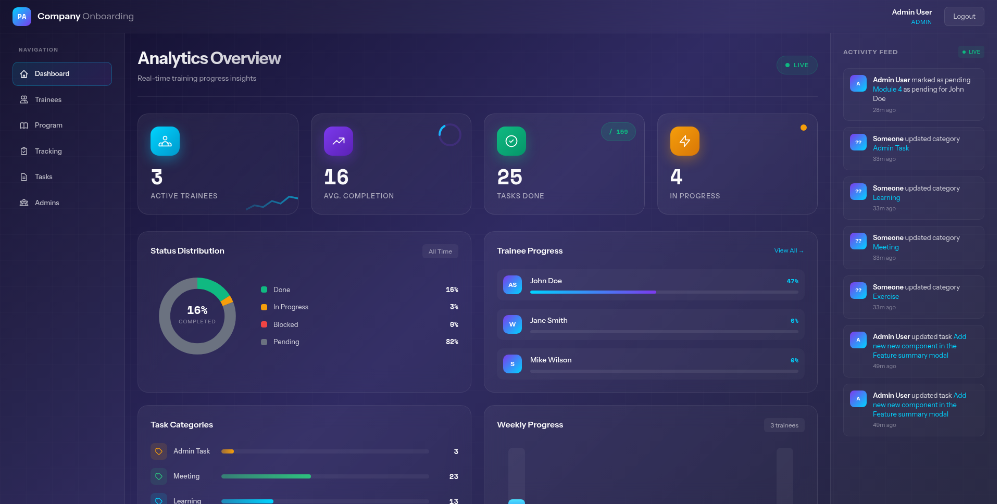
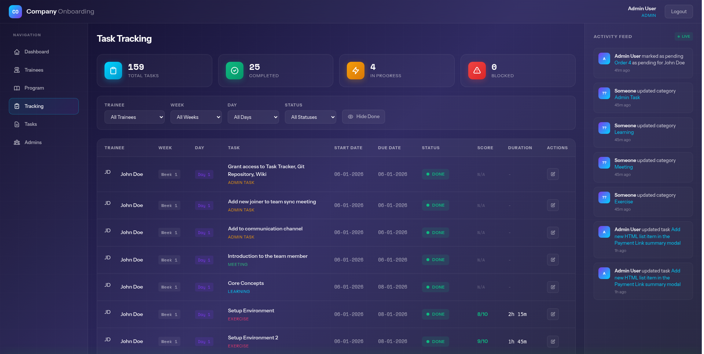

# Onboarding Tracker

A web application for tracking trainee onboarding progress.

## Screenshots

### Dashboard


### Task Tracking


## Features

- **Dashboard**: Overview of all trainees and their progress
- **Trainees Management**: Add, edit, and manage trainee profiles
- **Program**: Define weeks and tasks for the onboarding program
- **Task Tracking**: Track individual trainee progress on each task
- **Activity Feed**: Real-time activity log of all changes
- **PDF Export**: Generate task sheets for trainees

## Tech Stack

- **Frontend**: HTML, CSS, Alpine.js
- **Backend**: Supabase (PostgreSQL + Auth + RLS)
- **Build**: Vite + Bun

## Prerequisites

- [Bun](https://bun.sh/) (v1.0 or later)
- [Supabase CLI](https://supabase.com/docs/guides/cli) (for database migrations)
- A [Supabase](https://supabase.com) account

## Setup

### 1. Clone the repository

```bash
git clone git@github.com:afify/onboarding.git
cd onboarding
```

### 2. Install dependencies

```bash
bun install
```

Or use the Makefile:

```bash
make install
```

### 3. Create a Supabase project

1. Go to [supabase.com](https://supabase.com) and create a new project
2. Wait for the project to be ready
3. Go to **Project Settings** > **API** and copy:
   - Project URL
   - Anon public key

### 4. Configure environment variables

```bash
cp .env.example .env
```

Edit `.env` and fill in your values:

```env
VITE_SUPABASE_URL=https://your-project-id.supabase.co
VITE_SUPABASE_ANON_KEY=your-anon-key
VITE_COMPANY=YourCompany
VITE_DEBUG_CONSOLE=false
```

### 5. Link Supabase CLI to your project

```bash
bunx supabase login
bunx supabase link --project-ref your-project-id
```

You can find your project ID in the Supabase dashboard URL or in Project Settings.

### 6. Push database migrations

```bash
make push
```

Or manually:

```bash
bunx supabase db push
```

### 7. Create the first admin user

1. Go to your Supabase dashboard > **Authentication** > **Users**
2. Click **Add user** > **Create new user**
3. Enter email and password
4. Copy the user's UUID from the users list
5. Go to **Table Editor** > **mentors** table
6. Insert a new row:
   - `id`: paste the user's UUID
   - `name`: Your Name
   - `email`: same email used above
   - `role`: `admin`

### 8. Run the development server

```bash
make dev
```

Or manually:

```bash
bun run dev
```

The app will be available at `http://localhost:5173`

## Production Build

```bash
bun run build
```

The built files will be in the `dist/` directory.

To preview the production build:

```bash
bun run preview
```

## Available Commands

| Command | Description |
|---------|-------------|
| `make dev` | Install dependencies and start dev server |
| `make install` | Install Bun and dependencies |
| `make push` | Push database migrations to Supabase |
| `make lint` | Run all linters (JS, HTML, CSS) |
| `make lint-fix` | Auto-fix linting issues |
| `bun run build` | Production build to dist/ |
| `bun run preview` | Preview production build |

## Project Structure

```
├── index.html          # Login page
├── dashboard.html      # Main dashboard
├── trainees.html       # Trainee management
├── program.html        # Program management (weeks, tasks, categories, statuses)
├── tracking.html       # Task progress tracking
├── tasks.html          # Task PDF generation
├── admin.html          # Admin panel (manage mentors)
├── js/                 # JavaScript modules
├── css/                # Stylesheets
└── supabase/
    └── migrations/     # Database migrations
```

## License

BSD-3-Clause
